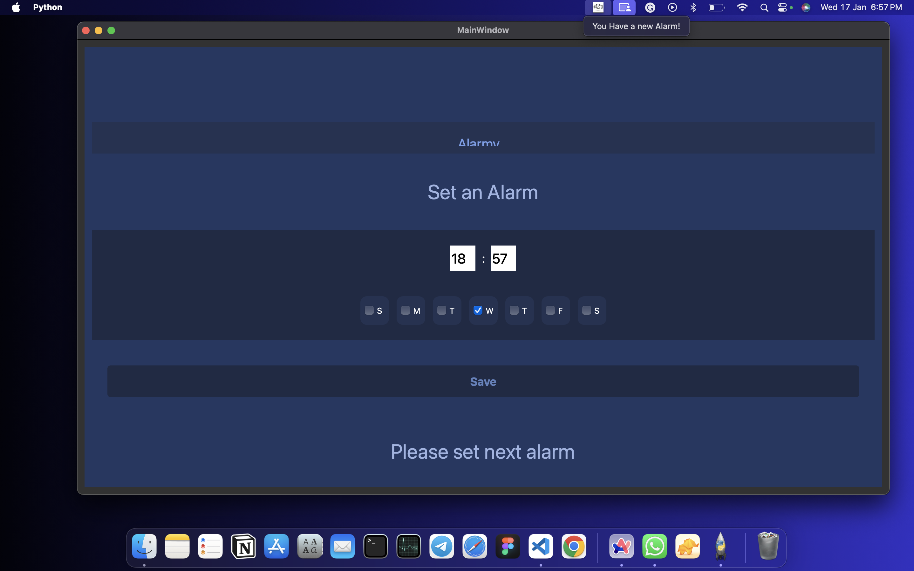
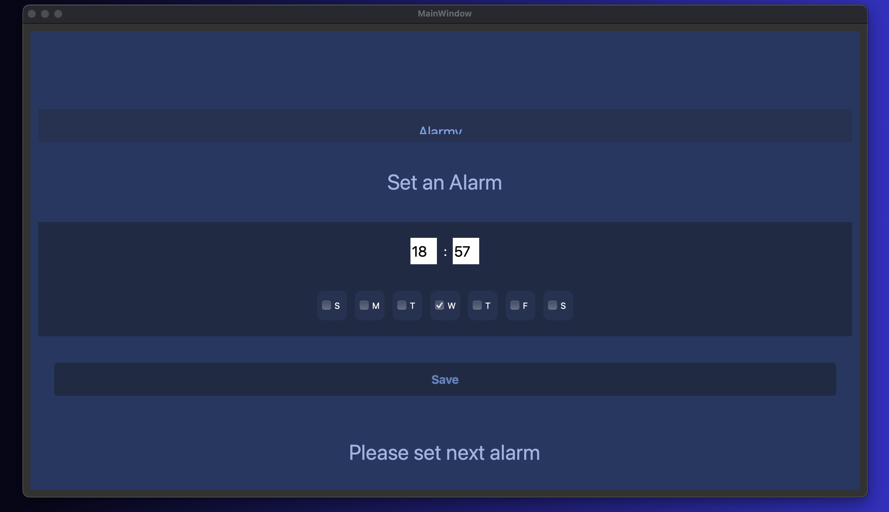

# Project description

This is an alarm app where user can set multiple alarms at once and will receive notification when alarm goes off as well as a sound alarm.
This project was made using PyQt a python QT framework for GUI.
Design of the project is stored inside alarm.ui file which can be opened using QT designer.
Rest of the logic is written in alarm.py file.
__init__.py file is made for when .apk will be made(working on it)

# How to run the project

1. Clone the repository

```bash
git clone 

```

2. Install the requirements using pip install -r requirements.txt

```python

pip install -r requirements.txt

```

3. Run the alarm.py file using python alarm.py

```python

python3 alarm.py

```

# App Screenshots

<b>Web and mobile UI Design</b>


<b>Notification on the screen</b>


<b>After alarm completed, it is saying to set the new alarm</b>

